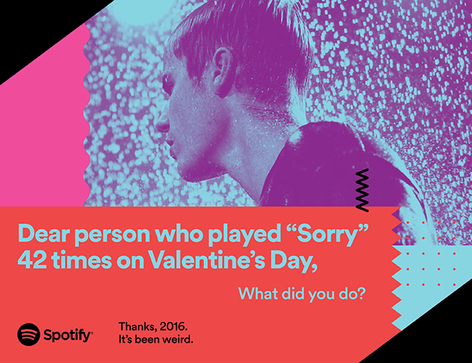

<!--# Web Design principles-->

# Unit Overview

### During this project you will produce an integrated advertising campaign that will champion your ideas, intelligence, communication and web media skills to potential employers, where: 

* You ​will work​ ​​individually​ ​​or​ ​in​ ​​teams​ ​of​ ​two​ ​​emulating​ ​a copywriter/art-director​ ​team. 
* After​ ​briefing,​ ​you ​will​ ​**research​ ​the​ ​target market​** ​around​ ​the client​ ​and​ ​product.
* You will think​ ​about​ ​**art-direction,​ ​concept​ ​and​ ​copywriting​** ​and​ ​produce​ ​a number solutions​ ​for​ ​your​ ​brief.
* You will develop​ ​the​ ​most​ ​**innovative​ ​solutions​** ​that​ ​address​ ​the​ ​**brief​** ​and​ ​the **target demographic**.
* You will pitch​ ​your research, ideation, chosen concept and branding direction ​at​ ​​**formative​ ​​stage​** ​for​ ​tutor​ ​and​ ​peer​ ​comment​.
* You will deliver​ ​a​ ​cross-media​ ​campaign​ ​solution​ ​for​ ​​**summative​ ​​stage** comprising of ​**a)​ ​campaign ​visuals,​ b) campaign touchpoints and c) a web​ enabled solution​.**

# Plan for the unit

When | In class | Homework 
---- | --------- | ----- 
[Monday 01.10.18](sessions/01)| <ul><li>Welcome <li>Intro to the brief<li>Holiday project presentations<li>Library Session| <ul> <li>Research folders
[Monday 15.10.18](sessions/02)| <ul><li> Research presentations <li>Research share <li>Campaign lecture <li>Class brainstorms: touchpoints & innovation| <ul><li>Concept Sketchnoting| 
[Monday 29.10.18](sessions/03)| <ul><li>Campaign concept share <li>Decision matrixes<li>Target market analysis<li>Creative touchpoints<li>Elevator pitches<li>Concept one pagers | 
[Monday 12.11.18](sessions/04) |  <ul> <li> Intro: Campaign Plans<li>Omni & multi channel advertising<li>Branding workshop |<ul> <li>Campaign branding<li>Formative presentations 
[Monday 19.11.18](sessions/05)| <ul><li>**Formative assessment**<li>Formative presentations<li>Self assessment<li>Online upload<li>Course feedback session| <ul> <li>Plan web based touch point<li> 
[Monday 26.11.18](sessions/07)| <ul> <li>Formative feedback tutorials<li>Workshop:Campaign plan| <ul> <li>Campaign plan mock ups
[Monday 03.12.18](sessions/09)| <ul><li>Class share:Campaign Plans<li>Recap of Summative Submissions<li> Project tutorials: Make action plans| <ul><li>Prepare summative
[Monday 10.12.18](sessions/10)| <ul><li>**Summative assessment**<li>Summative presentations<li>Online submission|

# Learning goals

By the end of this course, you will be able to:

1. Show that you have built upon initial knowledge of advertising and marketing to create ideas, concepts, conventional media and new media applications. 
2. Use self-initiative and develop good judgement in the presentation of work to a high professional standard that balances academic and competition requirements. 
3. Use editorial judgement on the selection of ideas, platform and approach for commercial use. 
4. Design an integrated solution that combines ideas with cross-media strategies, Web 2.0 and traditional technologies in a compelling integrated campaign. 
5. Demonstrate art-direction and copywriting skills associated with advertising and marketing. 
6. Show the application of entrepreneurial attributes and behaviour in project work, skills development and own personal promotion. 

# Rules of the road

* **Be present**. If you happen to be late or absent, make sure you email me about it before a session starts. 
* **Participate** in class lectures, tutorials and workshops. We'll make sure that your ideas have space to be heard and that nobody makes you feel uncomfortable about sharing them.
* **Present** your work during formative and summative assessments. If you can't make it those days then you'll record your presentation and upload it to YouTube (or similar).
* **Be responsible** for what happens in class. Organise with your peers to get class information and material that you may have missed.
* **Meet the deadlines**. If you submit your work after a deadline, your grade will be capped. Please see the brief for new details. 

### License

This work is licensed under a [Creative Commons Attribution-NonCommercial-ShareAlike 4.0 International License ](http://creativecommons.org/licenses/by-nc-sa/4.0)

