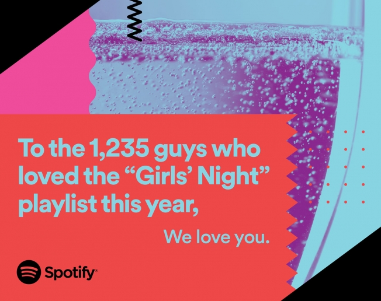

# Digital Advertising in the Interactive Age

 

### This is a **individual** or **team project for two** about creating a *digital advertising campaign*.

The​ ​currency​ ​of​ ​advertising​ ​is​ ​ideas​ ​and​ ​the​ ​key​ ​to success​ ​is​ ​the​ ​ability​ ​to​ ​generate​ ​ideas​ ​and​ ​solutions​ ​that​ ​sell​ ​the products whilst reaching out to a specific, identified consumer.​ ​As a result you will need to​ ​generate​ ​ideas​ ​and​ ​solutions​ ​whilst demonstrating how these ideas have been:

1. **Targeted:** ​produced​ ​for a specific target audience ​(concepts ​cannot​ ​be​ ​for​ ​a general​ ​audience).
2. **Editorialised:**  ​developed so that​ ​the​ ​most​ ​appropriate​ angles ​to the​ ​market/product/client​ ​have been exploited.
3. **Optimised:** ​​researched and delivered through​ ​the​ ​most effective​ touch points for the ​​targeted​ ​audience. 
4. **Integrated:** delivered with a clear strategy about how all touch points work together to create an integrated advertising campaign. 

### Integrating digital into the campaign

​​As​ ​web​ ​media specialists,​ ​student​ ​solutions​ ​to​ ​the brief​ ​need ​to integrate **at least one​** ​sophisticated​ ​digital touch point​ ​to​ ​impress​ ​employers.​ ​For this students will need​ ​to​ research​ ​digital innovation within the advertising industry (in the past this has been chatbots, snapchat,​ geolocation filters, ​virtual​ ​reality​ ​and interactive​ ​billboards)​.​ ​This​ ​year​ ​it​ ​will be​ ​something​ ​different.​ ​Whatever​ ​solution​ ​students find,​ ​consider: 

1. Innovation in the web connected industries and how this could be unitised to create “news” stories.
2. Viral​ ​marketing and social media and how this can be used to propel advertising campaigns to audiences.
3. How​ ​to​ ​enhance​ ​brand​ ​identity​ ​through web enabled products and services.
4. Making​ ​use​ ​of​ ​traditional​ ​online​ ​advertising​ ​(i.e.​ ​banner​ ​ads,​ ​bespoke apps,​ ​and​ ​videos)
5. Using​ ​your​ ​web-skills​ ​to​ ​make​ ​the​ ​WHOLE​ ​campaign​ ​work​ ​with​ ​one message.
6. Using prototyping and mockups to support any web based solutions put forward. 

## The brief

TODO

## The Process: The Double Diamond

Both this course, your class and homework tasks will follow the double diamond creative process where we will discover,define, develop and deliver your advertising campaign over the unit. 

 TODO - add image

## Deliverables

Throughout the unit students will build up a portfolio of project work consisting of: 

**Part A: Research Record Folder** (where the bibliography is 4 x A4 PDF Max and Ravensbourne Referenced and videos are supplied as stand alone files).

Students will upload a research pack consisting of an annotated bibliography showing a minimum of 8 research sources. Each source must be accompanied by EITHER a 100min - 200max word summary OR a video explanation (max 1min) detailing the sources contribution to current advertising practice or the value taken from the piece for the students project development. Of the 8 research sources: 

* 2 must be chosen from the unit reading list. 
* 2 must address current digital trends within the advertising industry. 
* 2 must address insight into the briefs target audience, their motivations, habits, behaviours and drivers.
* 2 must be selected from a fellow students annotated bibliography. 

In the case of submitting video explanations, the research source title must be clearly stated at the start of each video explainer. All videos must also be accompanied by a Ravensbourne referenced bibliography.

**Part B: A Campaign Branding Booklet** (12 x A4 PDF Max and supporting files):

The campaign branding booklet will document your campaigns development in terms of the creative idea, campaign touchpoints as well as the campaign brand aesthetic and should be delivered to a high visual design standard. This should include: 

* Detail of the three remarkable advertising campaigns chosen as part of your holiday research. 
* Detail of your initial 12 concepts for your campaign. 
* Detail of the concepts you chose to develop further and why (clear editorial decision making should be shown here). 
* Campaign mood boarding.
* A finished campaign one pager.
* Detail of your campaign touch point development, both physical and digital and why these are appropriate for target audience and campaign.
* Detail of the web media solutions/touch points chosen to support your campaign including functionality & any prototyping. (prototyping source files may be supplied separately to the booklet)
* Campaign branding experimentation. 
* Final campaign brand guidelines including: font, colour pallets, image moods, choice of models/images, logo size & restrictions etc.

**Part C: A Pitch Presentation** (Supplied as both PDF and PPT/KEYNOTE/GOOGLE SLIDES ECT): 

The pitch presentation should sell your final campaign idea pitch style to your brand or briefing company and as a result should be clear in concept, creative execution, research and purpose.  Presentations should also be branded to a high standard as outlined in your campaign branding booklet. This presentation should include: 

* The finished client-brief: A condensed slide outlining the problem that you are being asked to solve. No copies of full briefs please. 
* Your campaign proposal: What is the creative idea/solution to the problem. 
* Justification of creative concept: How does your campaign idea appeal to or  address your target market? 
* An overview of all campaign touchpoints suggested to launch your campaign, both physical and digital (at least one web media solution).
* Technical specifications/prototypes of an innovative web based touch point and how it integrates with the whole campaign: Answer: Why are you using this web solution? What does it bring to your campaign? How have you integrated the web technologies into your campaign? What is the functionality of your web based solution? 
* Justification of touch point choice. How have you identified the most suitable platforms for your campaign in order for it to be effective?
* A visual campaign plan detailing how your touch points work together to create an integrated advertising campaign: Answer: What media/experience will go out in which channel? How will this work over time? How does your approach to multiple channels make sense as a whole campaign?

**Part D: A blog post log** (A4 PDF) containing your blog posts in full, including supporting images. Please download/copy your posts into .PDF form, they will not be accepted as links.

## The brief :sparkle

## For Formative Presentation: Monday 20th November in Lecture hours

Students/teams will outline their chosen brief, their target audience insights and pitch their idea in presentation form.

This should incude:

* The concept elevator pitch. 
* Initial concept boards/pitch one pager. 
* Moodboard.
* Outline Campaign Plan. 

## For Formative Hand In: Monday 20th November before 4PM

* A finished client-brief (A single A4 PDF)
* Initial concept boards and mood-boards that outline the market (Max 3 xA4 PDF)
* Outline campaign plan (A4 PDF/keynote/PowerPoint)
* Presentation (A4 PDF/Keynote/PowerPoint)

## For Summative Presentation: Monday 11th December in Lecture hours

Students/teams will give their final pitch in a presentation form.

Those not presenting will note feedback for their peers. 

## For Summative Hand in: Monday 11th December before 4PM

Students will use the moodle links to submit: 

#### 1. A Campaign Proposal (4 x A4 PDF Max) that will include:

* The finished client-brief: A condensed online of the problem that you are being asked to solve. No full D&AD briefs please ;)
* Your Campaign Proposal: What is the **creative idea**. 
* Concept visuals: How will you communicate this with **images/typography**. 
* Outline of solutions: How is this designed to address your **target market**.
* Technical specifications of the **web solution** and how it integrates with the whole campaign: How have you integrated the web/web technologies into your campaign. What is this functionality. 
* Campaign plan: What media/experience will go out in which channel? How will this work over time? How does your apprach to multiple channels make sense as a whole campaign? 

#### 2. A Project/Research Folder (4 x A4 PDF Max - Harvard Referenced) that will include:

* Concise documentation outlining the research stages and physical/online reading and campaign references that have contributed to the project.

#### 3. A Pitch Presentation (Supplied as **both** PDF and PPT/KEYNOTE/GOOGLE SLIDES ECT). 

*  Please remember to supply versions of your presentations that are easily opened for unit assessment. It is your responsibility to make sure that markers can see your work. 

#### 4. A Blog Log (1 x A4 PDF Only) containing links to the blog posts that you have published each week for the course. 

This blog log will contain posts on:

* Week 1: [Seth Godin's How to Get Your Ideas to Spread.](https://github.com/RavensbourneWebMedia/Digital_Advertising/tree/Digital_Advertising_2017/18/sessions/01#homework)
* Week 2: [Moodboards.](https://github.com/RavensbourneWebMedia/Digital_Advertising/tree/Digital_Advertising_2017/18/sessions/02#homework)
* Week 3: [Rory Sutherland's Life Lessons of an Ad Man](https://github.com/RavensbourneWebMedia/Digital_Advertising/tree/Digital_Advertising_2017/18/sessions/03#blog)
* Week 4: [Reflective: Course Work so far.](https://github.com/RavensbourneWebMedia/Digital_Advertising/tree/Digital_Advertising_2017/18/sessions/04#homework) 
* Week 5: [Reflective: Formative Feedback](https://github.com/RavensbourneWebMedia/Digital_Advertising/tree/Digital_Advertising_2017/18/sessions/05#homework)
* Week 6: Analyse 2 previous D&AD New Blood Winners.
* Week 7: [Make a Weekly Planner documenting the work that you need to do this week](https://github.com/RavensbourneWebMedia/Digital_Advertising/tree/Digital_Advertising_2017/18/sessions/07#blog) Use your blog post to reflect on the process of completeing the work that you have on your planner.

