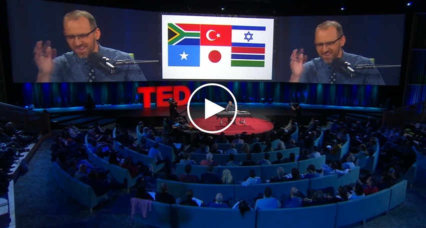
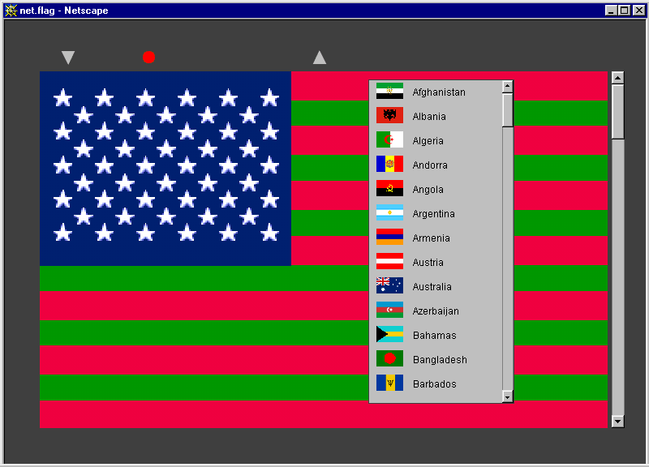

# Digital Advertising Campaign

This is a **individual** or **team project for two** about creating a *digital advertising campaign*.

Flags are powerful visual symbols, brands before *branding* was even a discipline. By designing flags, you will devise symbols to represent *identities* and convert ideas into shapes. 

First you will *mash up* existing flags, and then *make your own* flag. 

1. Form **teams** of 2-3 people.
*  Watch [this TED talk](http://www.ted.com/talks/roman_mars_why_city_flags_may_be_the_worst_designed_thing_you_ve_never_noticed) about the rules of good flag design (and some funny examples of bad flag design).
  
	
* **MASH UP A FLAG** 

	Pick an existing flag and mash it up following these criteria:
	
	* Change one or more of its colours
	* Add or remove one or more elements
	* Change one or more shapes
	* Any of the above in combination 
	
	Produce minimum **4 variations** of your flag mash-up.
* **FOR SUMMATIVE HAND IN: SUNDAY 19TH MARCH 2017 BEFORE 23:50PM**

Students will use the moodle links to submit: 

1. A Campaign Proposal (4 x A4 PDF Max) that will include:

* The finished client-brief: A condensed online of the problem that you are being asked to solve. No full D&AD briefs please ;)
* Your Campaign Proposal: What is the **creative idea**. 
* Concept visuals: How will you communicate this with **images/typography**. 
* Outline of solutions: How is this designed to address your **target market**.
* Technical specifications of the **web solution** and how it integrates with the whole campaign: How have you integrated the web/web technologies into your campaign. What is this functionality. 
* Campaign plan: What media/experience will go out in which channel? How does your apprach to multiple channels make sense as a whole campaign. 

2. A Project/Research Folder (4 x A4 PDF Max - Harvard Referenced) that will include:

* Concise documentation outlining the research stages and physical/online reading and campaign references that have contributed to the project.

3. Your Pitch Presentation (Supplied as **both** PDF and PPT/KEYNOTE/GOOGLE SLIDES ECT). 

> This may be modified after summative presentation to reflect any feedback received in the session. 

> Please remember to supply versions of your presentations that are easily opened for unit assessment. It is your responsibility to make sure that markers can see your work. 

### Inspirations

* Mark Napier's [**net.flag**](http://marknapier.com/netflag) is a participatory piece of art, in which visitors  mash up national flags to create a *flag for the Internet*. 

 	> Every nation on earth has a flag that identifies the territory of that nation, and the flag is a symbol of conquest of new territory. 
 	
 	> An online software interface makes the visual language of international flags available to anyone with Web access. The visitor to *net.flag* not only views the flag but can change it to reflect their own nationalist, political, apolitical or territorial agenda.

	
