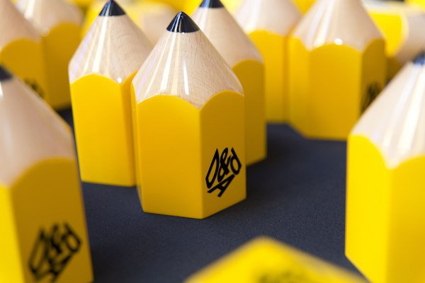
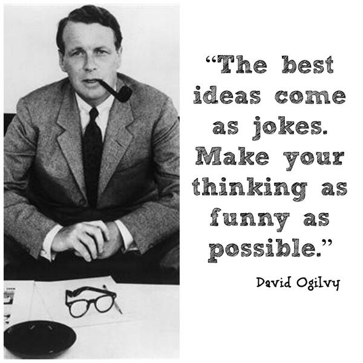
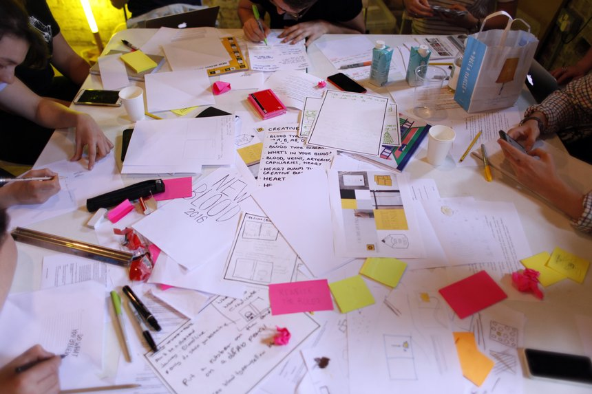

# Week 1

### Monday 2nd October 2017

1. [Welcome](#welcome) :)
2. Lecture & Discussion: [A Brief History of Advertising](#a-brief-history-of-advertising)
3. Intro: [D&AD New Blood Briefs](#d&ad-new-blood-briefs)  
4. Workshop: [Breaking Down A Brief](#workshop-breaking-down-a-brief)
5. Housekeeping: Where do you blog? What do you host? Pop these in this [googledoc](https://docs.google.com/spreadsheets/d/1UmrIu1Am9zldfDFPc6O5JpzulP3A7LAZG0EcaJSleXo/edit?usp=sharing)

### Your [homework](#homework) and [blog](#blog)!

# Welcome

1. [What is this course about?](../../README.md)
2. [What's the plan?](../../README.md#plan) 
3. [What can you learn?](../../README.md#learning-goals)
4. Keeping a **journal** to record your creative process is *extremely* important. Don't let your ideas and thoughts fade away! Think of your project blog as your **digital sketchbook**. More on that [here](https://github.com/RavensbourneWebMedia/Blogging#why-blogging).
5. Reading lists and perusing the library (I'll also share some PDFs).

# A Brief History of Advertising

### What is [Advertising](https://en.wikipedia.org/wiki/Advertising)

What are **your thoughts?**

 [Advertising Presentation](https://github.com/RavensbourneWebMedia/Digital_Advertising/blob/master/sessions/01/Brief_History_of_Advertising_2016_Morning_Session.pdf)

# D&AD New Blood Briefs

What does D&AD stand for? 

- [ ] Digital and Analogue Design?
- [ ] Design and Art Direction?
- [ ] Directors and Assistant Directors? 

The [D&AD New Blood Awards](http://www.dandad.org/en/d-ad-new-blood-awards/) are for new talent entering the advertising and creative industries. Each year 16 briefs are supplied by industry and students (as well as under 24's) are invited to respond. This year we will work with briefs from 2016/17 and look at examples of winners in their categories. 

Why repond to one of the the D&AD briefs?

* Industy recognised briefs in creative advertising. 
* High standard of brief writing as briefs are distributed to lots of students / young professionsals. 
* Responding to idustry shows you are savey and have ambition. 
* Project for portfolios: A great opportunity to show work on industry brief. 
* Good opportunity to make a project of a high standard for the degree show. 

## The Briefs 

This year we will work with 16 briefs put forward by the following industy leaders:

1. Adobe
2. Amazon
3. Arjowiggins
4. BBC 
5. Crowne Plazaa
6. Desperados
7. Hasbro
8. John Lewis
9. Monotype
10. MUBI
11. Nationwide
12. Pearson
13. Respect for Animals
14. Squarespace
15. The British Army
16. The National Autistic Society

You can access the briefs on [moodle] (TODO: add brief link) if you need then at a later dates but for now I have them on a hard drive to share with you to save time.  

As there are 12 briefs and 16 of us, lets each take a brief each plus some, would anyone do an extra? 

We will need to summarise each briefs key paragraphs to the class. These can be found within the "background", "challenge" and "who's it for" sections. 

If we each take one / two and present to the class, this way we can cover each quickly. 

Let's take 3 mins to read through our briefs before sharing them. 

**Note**, some may be more relevant than others as we will be working toward making a **digital campaign or product** as a response. 

**Discussion**

Now that we have heard each brief, which will you choose? Consider:

* Which briefs spark ideas in your minds / seem to be engaging? Advertising is all about the creative idea!
* Which briefs call for a digial response? Are there any breifs that rules this out? 

**Words of Wisdon**

Wise words from previous advertising industry professionals tackeling D&AD briefs:

1. **The idea is King.** Spent time thinking about what to suggest for your brief. 
2. **Treat Tech with Caution.** This will be key for us as our responses will be digital. Let's make sure we have good reasons for using the web / mobile app / online platforms. Explain these clearly. 
3. **Tell A Story** Stories are a powerful tool in human communication. Tap into this wherever possible with your campaign. 

We will touch on these points in more depth later in the course but using these early to help craft your concepts will be useful. 

# Workshop: Breaking Down A Brief

Let's get started by choosing one of the 16 D&AD briefs and leaning how to break down the brief. The brief you choose doesn't have to be your final choice!

Briefs are essential but they can be overwhelming, so lets deconstruct our brief so get to the **heart** of what we're being asked for. 

Before we start, read your brief one more time so it's fresh in your mind. 

## Task 1: 5 Mins

Reread your brief but think about the **essential** points are, what **specific words communicate** and key pieces of info that **stand out**. Highlight them.

You are now going to break down the brief into just 16 words. These 16 words should communicate what the brief is asking you to do. Imagine you are giving this to someone instead of the full brief. How can you get them to understand what the task is in the same way but in only 16 words? Pull in any of the specific info or words you highlighted to help you.

Note down your 16 words only. 

## Task 2: 2 Mins

From your 16 words, really think again about what the **crucial points** are.

How many words could you shave and still communicate what the brief is asking you to do?

Let's try do it in 8? Ok, let's do it. 

In 8 words, what is the brief asking you to do? Rearrange the ones you have, use 8 new words or mix it up.

## Task 3: 1 Mins

So now you've got it down to the bare bones right? Those 8 words are all gold and they are completely vital. But which ones could you do without?

Try and get it down to just 4 words. Remember, you are trying to communicate as much of the information from the full brief as possible. 

Think about which words carry the most meaning.

## Task 4: 1 Mins

What next? Let's slim it down to 2 words.

Now you have your whole brief squeezed down into 2 words. You have identified the **heart** of your brief. 

It wouldn't be a good idea to use only these words when building your concepts, but now the other words and context of the brief should feel like a luxury. 

As you work on ideas for your brief, refer back and ask, "Is my idea / campaign communicating the 2 word, **heart** of my brief?"

# Homework

### Brief Breakdown and Ideation

Working on your own or in your chosen group of 2:

Choose the **D&AD Brief** that you will respond to for this unit from the list below:

- Adobe
- Amazon
- Arjowiggins
- BBC 
- Crowne Plazaa
- Desperados
- Hasbro
- John Lewis
- Monotype
- MUBI
- Nationwide
- Pearson
- Respect for Animals
- Squarespace
- The British Army
- The National Autistic Society

Or write your own brief and:

- Create 20 concepts / ideas for a campaign that responds to your chosen brief. 
- Choose the **3 strongest ideas** and explain how they **stand out.** 
- Detail how these 3 respond to the **heart** of the brief that you've chosen. 
- Bring your **3 ideas** ready to explain to the class next week. You will have max **2 minutes** to explain each idea. 

### Blog 

Watch Seth Godin’s TED talk on [How to get your ideas to spread](https://www.ted.com/talks/seth_godin_on_sliced_bread) and reflect on the content of the lecture and key themes. Note your thoughts on the lecture and how this might relate to your own work. 

Choose 3 **stand out** digital advertising campaigns and explain what makes them "remarkable" in comparison to other campaigns. 

