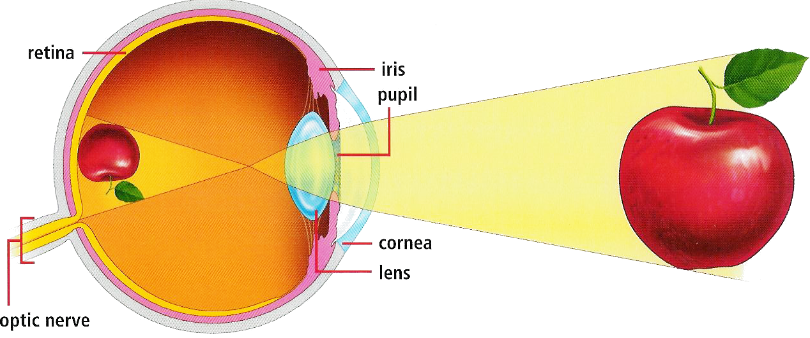
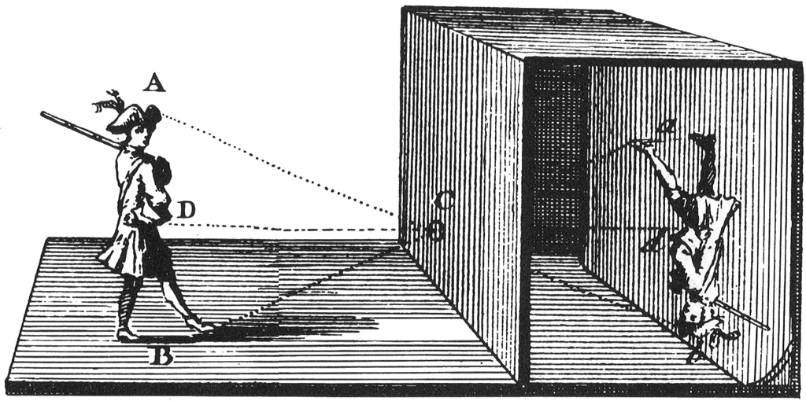

# Week 1

### Thursday 12th January 2017

1. [Welcome](#welcome) :)
* Discussion: [A Brief History of Advertising](#A-Brief-History-of-Advertising)
* Intro: [D&AD Briefs](#Intro-D&AD-Briefs)  
* Workshop: [Breaking Down A Brief](#workshop)

### Your [homework](#homework) and [blog](#blog)!

# Welcome

1. [What is this course about?](../../README.md)
* [What's the plan?](../../README.md#plan) Make sure you subscribe to the [calendar feed](https://www.google.com/calendar/ical/rave.ac.uk_agop0ff7kdgdc289jdrl5021gs%40group.calendar.google.com/public/basic.ics)! 
* [What can you learn?](../../README.md#learning-goals)
* Keeping a **journal** to record your creative process is *extremely* important. Don't let your ideas and thoughts fade away! Think of your project blog as your **digital sketchbook**. More on that [here](https://github.com/RavensbourneWebMedia/Blogging#why-blogging).
* Reading lists and perusing the library (I'll also share some PDFs).

# A Brief History of Advertising

### Looking before creating

One of the key skills of a designer is the ability to look at what surrounds you and **see the possibilities** for how things can be *framed*. By *training your mind* to see these possibilities, you'll be able to recognise them when you're out with your camera. 

> One should not only photograph something for what it is, but also for **what else** it is.

> [Minor White](https://en.wikipedia.org/wiki/Minor_White), photographer

### What else could this be?

When you're about to snap a picture, or when browsing through images, always ask yourself: 

*What else could this be?* 

### How do we *see*? 

<!--[The Stage Theory Model](https://en.wikipedia.org/wiki/Atkinson–Shiffrin_memory_model):-->

1. **Notice**   
	
	Our senses pick up **stimuli** and pass them on to the brain. 
	
	In the case of vision, **light** enters our eyes and stimulates our **retina**. Notice how light that comes from the *top* of our vision field will make an impression at the *bottom* of our retina.
	
	The optic nerve attached to the retina transfers that *raw data* to the brain.	
2. **Make sense**  
	
	It is the brain that *flips* visual back to their natural orientation, to form *images* and **make sense** of what surrounds us.
	
	When data has entered the brain, we have the option to discard it or continue thinking about it. Information stays for about 20-30 seconds in *short-term memory* before it is either forgotten or passed on to *long-term memory*.

### What is the difference between *seeing* and *looking*?
	
You should watch the series [Ways of Seeing](https://youtu.be/XShzabEv8bM?t=2m37s) by John Berger (and/or read [the book](https://en.wikipedia.org/wiki/Ways_of_Seeing)). All the following quotes come from the book.
	
> Seeing comes before words. The child looks and recognises before it can speak.

We *see* with our eyes but we *make sense* of it with our brains. 

Looking is the result of an **active decision**. We decide what to look at and what to ignore.

> Each evening we *see* the sun set. We *know* that the earth is turning away from it. Yet the knowledge, the explanation, never quite fits the sight. 

### How does our brain *make sense* of the things we see?

Are these apples? How do you [know](http://courtauld.ac.uk/gallery/collection/paintings/renaissance/lucas-cranach-the-elder-adam-and-eve)?

* Habit
* Convention
* Past experiences
* Mental models
* Context
* Contrast (noticeable differences)
* Culture
* Taste

> Looking is less spontaneous and natural than we tend to believe [...] The way we see things is affected by what we *know* or what we *believe*.

<!-- > We never look at just one thing; we are always looking at the **relation between things and ourselves**. -->

<!-- > But there is also another sense in which seeing comes before words. It is seeing which establishes our place in the
surrounding world; we explain that world with words, but words can never undo the fact that we are surrounded by it. -->

### What is an *image*?

A large percentage of what we see on a daily basis are not first-hand impressions, but *images*.

> An image is a sight that has been **recreated** or reproduced.
	
### Can you see the similarities between an *eye* and a *camera*?

Why is it called [*camera*](https://en.wikipedia.org/wiki/Camera_obscura) btw?

<!--https://commons.wikimedia.org/wiki/File:Camera_obscura2.jpg#/media/File:Camera_obscura2.jpg-->

### Do you *take* a photograph or *make* a photograph?

> Every image embodies a way of seeing. Even a photograph. For photographs are not, as is often assumed, a mechanical record. Every time we look at a photograph, we are aware, however slightly, of the photographer selecting that sight from an infinity of other **possible sights**.

<!--### How do we create images?

* What are you looking at?
* How do you look at things?
* How do you want things to be looked at?
* What do you look like?
* What is the relationship between what you see and what you make? What you make and how you are seen?-->

# Intro: D&AD New Blood Briefs

What does D&AD stand for? 

- [ ] Digital and Analogue Design?
- [ ] Design and Art Direction?
- [ ] Directors and Assistant Directors? 

The [D&AD New Blood Awards](http://www.dandad.org/en/d-ad-new-blood-awards/) are for new talent entering the advertising and creative industries. Each year 16 briefs are supplied by industry and students (as well as under 24's) are invited to respond. 

Why enter the D&AD awards?

* Industy recognised award in creative advertising. 
* High standard of entries. 
* Shows savey and ambition to enter. 
* Great opportunity to show work on live industry brief. 
* Good opportunity to make a project of a high standard for the degree show. 

Key Dates:

* March 22nd 2017: D&AD Submission deadline (Note this is after summative and you will need to enter through Rave to have your entry paid by the course.)
* 6th July: Awards announced. 

# Workshop

Let's get started by choosing one of the 16 D&AD briefs and leaning how to break down the brief. 

Briefs are essential but they can be overwhelming, so lets deconstruct our brief so get to the **heart** of what we're being asked for. 

Before we start, read your brief one more time so it's fresh in your mind. 

Task 1: 5 Mins

Reread your brief but think about the **essential** points are, what **specific words communicate** and key pieces of info that **stand out**. Highlight them.

You are not going to break down the brief into just 16 words. These 16 words should communicate what the brief is asking you to do. Imagine you are giving this to someone instead of the full brief. How can you get them to understand what the task is in the same way but in only 16 words? Pull in any of the specific info or words you highlighted to help you.

Note down your 16 words only. 

Task 2: 2 Mins

From your 16 words, really think again about what the **crucial points** are.

How many words could you shave and still communicate what the brief is asking you to do?

Let's try do it in 8? Ok, let's do it. 

In 8 words, what is the brief asking you to do? Rearrange the ones you have, use 8 new words or mix it up.

Step 3: 1 Mins

So now you've got it down to the bare bones right? Those 8 words are all gold and they are completely vital. But which ones could you do without?

Try and get it down to just 4 words. Remember, you are trying to communicate as much of the information from the full brief as possible. 

Think about which words carry the most meaning.

Step 4: 1 Mins

What next? Let's slim it down to 2 words.

### GitHub 

Check out [this handy guide](https://github.com/RavensbourneWebMedia/Guides/blob/master/how-to-git.md) on *what* Git is, *how* it works and *why* you should use it.

It boils down to a couple of things:

* **Organisation**: keeping backed up versions of your work.
* **Collaboration**: working on the same projects with many other people (*many* can mean thousands) effectively.

### MarkDown

MarkDown (MD) is the default rich-text format on GitHub.

What does **marking up** mean?

# Homework

### Brief Breakdown and Ideation

Working on your own or in your chosen group of 2:

Sign up to take part in the 2017 [D&AD New Blood Competition] (http://www.dandad.org/?next=/). Ravensbourne will pay for your entries if you want to make a submission at the end of the course :).

Choose an **vD&AD Brief** set by industry from the list below:

1. Adobe
* Amazon
* Arjowiggins
* BBC 
* Crowne Plazaa
* Desperados
* Hasbro
* John Lewis
* Monotype
* MUBI
* Nationwide
* Pearson
* Respect for Animals
* Squarespace
* The British Army
* The National Autistic Society

Or write your own brief and:

1. Create 20 concepts / ideas for a campaign that responds to your chosen brief. 
* Choose the 5 strongest ideas and explain how they "stand out". 
* Detail how these 5 respond to the "heart" of the brief that you've chosen. 
* Bring your 5 ideas ready to explain to the class next week (bearing in mind you will have max 2 minute to explain each idea). 

### Blog 

1. Watch Seth Godin’s TED talk on [**How to get your ideas to spread.**] (https://www.ted.com/talks/seth_godin_on_sliced_bread) and reflect on the content of the lecture and key themes. Note your thoughts on the lecture and how this might relate to your own work. 
* Choose 3 "stand out" digital advertising campaigns and explain what makes them "remarkable" in comparison to other campaigns. 

