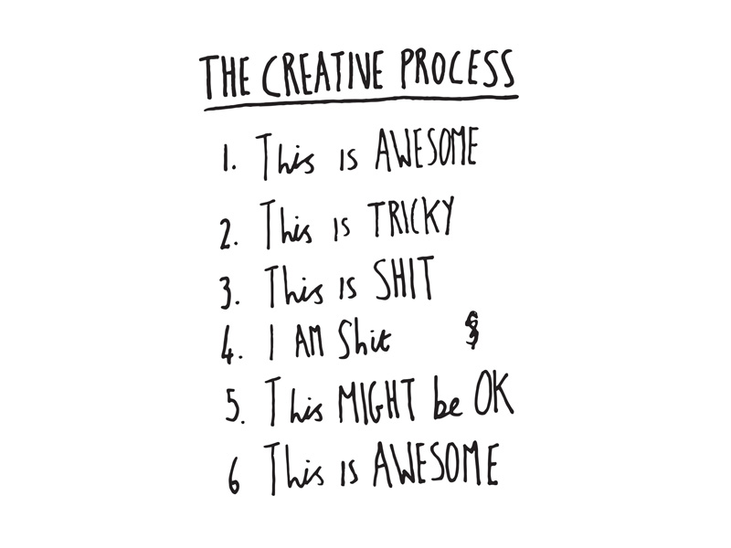

# Week 3

### Today, Thursday 26th January 2017

1. Mini Presenation: [The Degree Show](#the-degree-show)
* Mini Lecture: [The Creative Process](#the-creative-process)   
* Mini Lecture: [Advertising Agency Structure](#advertising-agency-structure)
* Tutorials: Elevator Pitches, Pitch Documents and Moodboards. 

### Your [homework](#homework) and [blog](#blog)!

# The Degree Show

The Ravensbourne Degree Show 2017 will be between XX XX June. The Web Media private view will be on XXX. 

In previous years the web media room has looked a little inconsistant whereas the degree show standard is very high. 

There is Ravensbourne budget to help put up your stands and set up the room so I would like to propose that we work together to design the room for this year. 

Examples of stands 2015/2016. **Add presentation here.** 

# The Creative Process

This weeks lecture will take us through the typical creative process followed in advertising agencies. 

[Advertising Agencies: The Creative Process] (https://github.com/RavensbourneWebMedia/Digital_Advertising/blob/master/sessions/03/Digital%20Advertising%202016%20Lecture%203%20Creative%20Process.pdf)

Let's take a break!

# Advertising Agency Structure

Our second mini lecture will outline the main departments, job roles and key responsibilities undertaken within most advertising agencies. 

[The Advertising Agency](https://github.com/RavensbourneWebMedia/Digital_Advertising/blob/master/sessions/03/The%20Advertising-Agency.pdf)

Are any of these roles positions that you would consider for the future? 

### Tutorials: Elevator Pitches, Pitch Documents and Moodboards. 

For the rest of the session I will do one on one tutorials for everyone working on a separate brief. 

Please have the following ready for your tutorial:

* Your chosen Brief (locked down now)
* Your top 3 concepts from last week. 
* Your elevator pitches.
* Your Pitch Documents/One Pagers. 
* Your Moodboards. 

If would like some more time to work on these docs, let me know any you can have your tutorial in one of the later slots. 
 

# Homework

Prepare to present your **ideas**, **experiments** and **creative process** to your colleagues and a special guest next week (28th of October, **formative presentations**).

You'll be presenting your work on:

1. EyeBombing
2. OneTweet
3. The Union Hack

Just to clarify: the **final deadline** for all projects is the **5th of December**, so you can continue working on it throughout November. However, we will be starting another project after the formative, so the more you do before the formative, the better.

### Typography

1. **Publish** your mini-lesson and any other relevant material from today. We recommend GitHub (we :green_heart: :octocat:) but you can publish elsewhere as long as it's accessible by anyone.

2. Add the link to your mini-lesson and any other relevant material to the Google document I emailed you (it's also on Slack).

### Peer learning research ( due for the week after next, Friday 4th Nov)

### Project 

Work on *The Union Hack* with your **team**.

1. Set up a GitHub repository for your team project.
* Mash up existing flags.
* Jot down ideas for places (real or imaginary) and the flag(s) you could design for them.

### Blog 

**Individually**, write about *The Union Hack*. 

Reflect on the concept and document **your** creative process. 

You can post pictures of scribbled notes, or jot down notes digitally. It doesn't need to be fleshed out and well written. The main goal here is to record your flow of ideas, not to make it beautiful!

