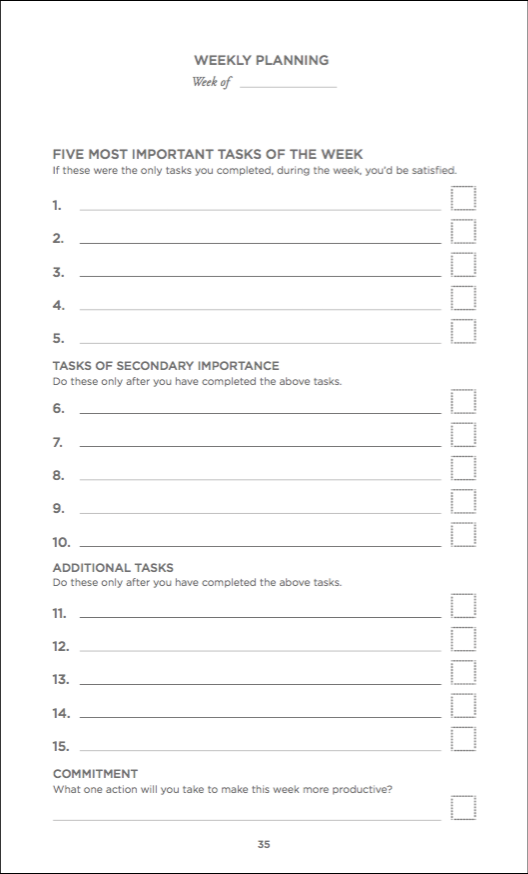

# Week 9

### Today, Thursday 9th March 2017

1. Lecturing: [Viral Marketing](#viral-marketing)
* [Tutorials](#tutorials) on *Your Advertising Campaigns*

#### Your [homework](#homework) and [blog](#blog)

# Viral Marketing

This week we will look at viral marketing and how you can create campaign elements that people will share organically. 

[Full lecture notes.](https://github.com/RavensbourneWebMedia/Digital_Advertising/blob/master/sessions/09/Digital_Advertising-viralmarketing.compressed.pdf)

# Tutorials

1. Go through the :ballot_box_with_check: [**checklist**](../10/#checklist) :ballot_box_with_check: for everything you have to hand in next week.
* Use the [Productivity Planner](https://drive.google.com/open?id=0B0FP625GojKHRlJRZWQ4cjVvSFk) to plan the final sprint!

# Homework

### Prepare summative 

Tweak *all* your work in this unit so that you can **present** it next week during the *summative assessment*. 

Check the :ballot_box_with_check: [**checklist**](../10/#checklist) :ballot_box_with_check: for everything you have to hand in!

### Blog

#### `How to {YOUR CSS TRICK HERE}`

Polish up your **CSS trick demo** and write a *how to* post for anyone to learn it. 

Publish it to GitHub / Medium.

This will become part of a series of tutorials that we'll publish on the Web Media official site next year!